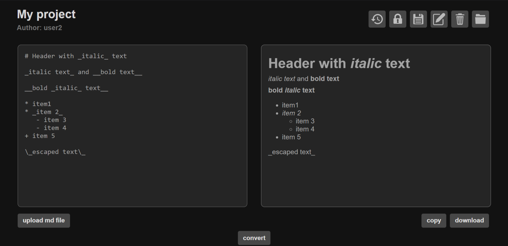

# Markdown Converter 

A web application for converting markdown markup to html. It is possible to save documents, work with them over time, edit, delete, and share access with other users. There are 2 roles: reader and editor. There is also a history of document changes to track the status.

## Technology stack
- Backend: ASP.NET Core 8, C#
- Database: PostgreSQL, MongoDB
- S3 storage: MinIO
- Cache: Redis
- ORM: Entity Framework Core
- Docker 
- Tests: xUnit

